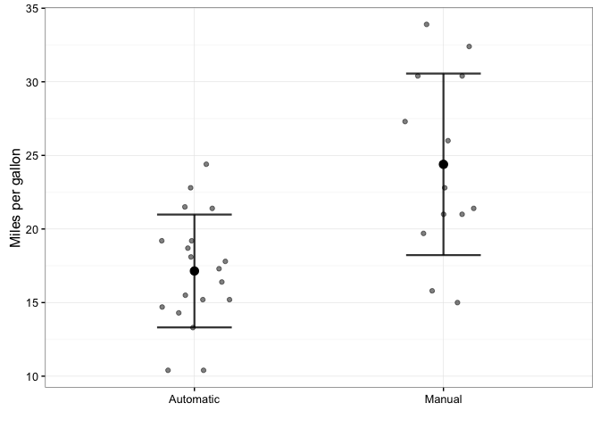
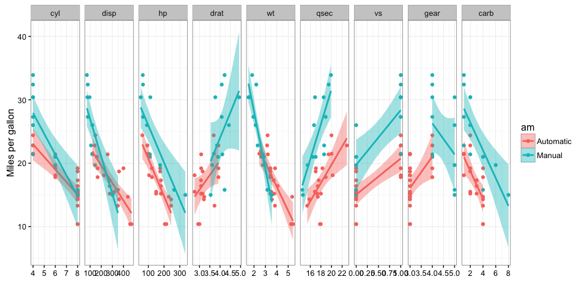
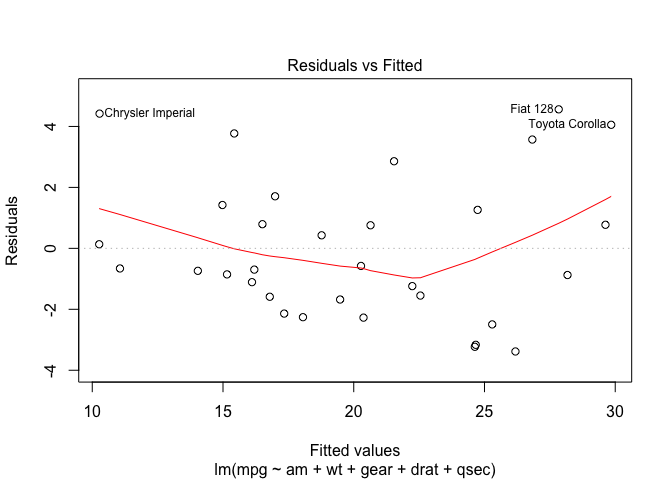
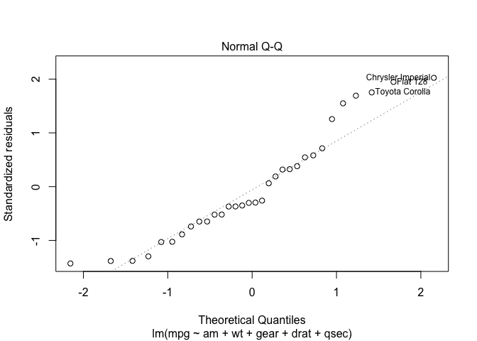
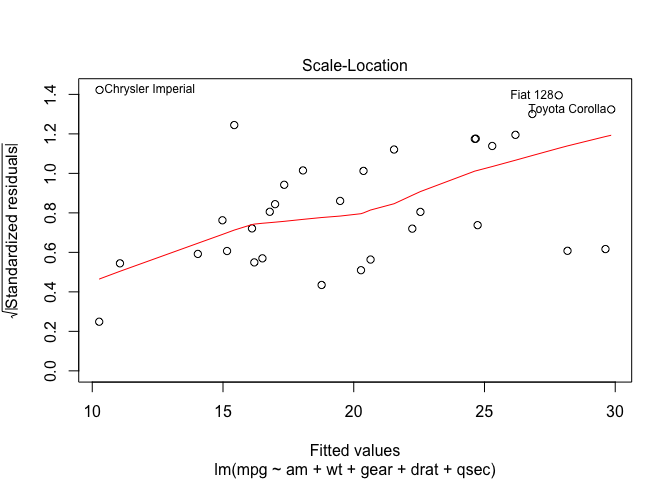
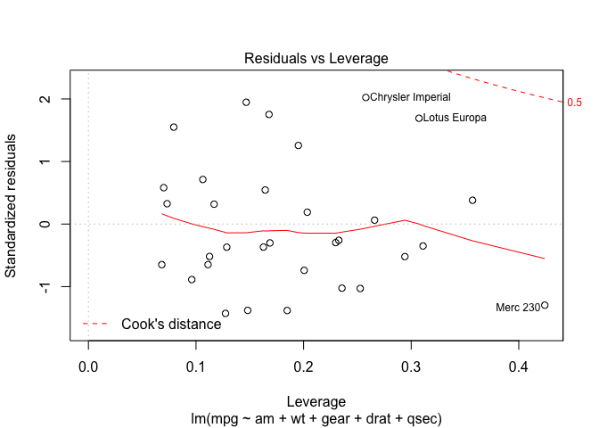

# Automatic vs manual transmission
Dr Mark Thomas  
1 April 2016  

```r
library(ggplot2)
library(GGally)
library(reshape2)
library(caret)
```

```
## Loading required package: lattice
```

```r
data(mtcars)
mtcars$am <- factor(mtcars$am, labels=c("Automatic","Manual"))
mtcars$name <- rownames(mtcars)

fig1 <- ggplot(mtcars, aes(am, mpg))+labs(x="", y="Miles per gallon")
g1 <- geom_point(size=1.5,alpha=0.5,position=position_jitter(width=0.4,height=0))
g2 <- stat_summary(fun.y = mean,geom="point",color="black",size=3)
g3 <- stat_summary(fun.data=mean_sdl,fun.args = list(mult = 1), geom="errorbar", 
                   color="black", size=0.8, width=0.3, alpha=0.8)
g4 <- theme_bw()
fig1 <- fig1 + g1 + g2 + g3 + g4
fig1
```



```r
unadjFit <- lm(mpg~am, data=mtcars)
summary(unadjFit)
```

```
## 
## Call:
## lm(formula = mpg ~ am, data = mtcars)
## 
## Residuals:
##     Min      1Q  Median      3Q     Max 
## -9.3923 -3.0923 -0.2974  3.2439  9.5077 
## 
## Coefficients:
##             Estimate Std. Error t value Pr(>|t|)    
## (Intercept)   17.147      1.125  15.247 1.13e-15 ***
## amManual       7.245      1.764   4.106 0.000285 ***
## ---
## Signif. codes:  0 '***' 0.001 '**' 0.01 '*' 0.05 '.' 0.1 ' ' 1
## 
## Residual standard error: 4.902 on 30 degrees of freedom
## Multiple R-squared:  0.3598,	Adjusted R-squared:  0.3385 
## F-statistic: 16.86 on 1 and 30 DF,  p-value: 0.000285
```
The unadjusted coefficient for manual gearbox vs automatic gearbox is 7.245 (p<0.001). This implies that cars with manual gearboxes allow 7.25 miles per gallon more than automatic gearboxes.

However, this is observational data and there are potential confounders that need to be taken into account. Next, the relationship between mpg and other variables in the dataset is investigated.

```r
meltmtcars <- melt(mtcars, id.vars=c("name", "mpg","am"))
ggplot(meltmtcars, aes(value, mpg, color=am)) + geom_point() + geom_smooth(method="lm",aes(fill=am)) + facet_grid(.~variable,scales = "free")+labs(x="", y="Miles per gallon") + g4
```



There is clearly a strong linear relationship between mpg and cyl,disp,hp,drat,wt,qsec,vs,gear and carb. It is therefore possible that the relationship between am and mpg may not be independent of all of these other factors. Plotting all variables against mpg and splitting them by am shows that there are no clear interactions between the other variables and am.

Many of the other variables are also highly correlated, some with pearson R values of over 0.8 which suggests very strong correlation:

```r
cor(mtcars[,!names(mtcars)%in%c("name","am")])
```

```
##             mpg        cyl       disp         hp        drat         wt
## mpg   1.0000000 -0.8521620 -0.8475514 -0.7761684  0.68117191 -0.8676594
## cyl  -0.8521620  1.0000000  0.9020329  0.8324475 -0.69993811  0.7824958
## disp -0.8475514  0.9020329  1.0000000  0.7909486 -0.71021393  0.8879799
## hp   -0.7761684  0.8324475  0.7909486  1.0000000 -0.44875912  0.6587479
## drat  0.6811719 -0.6999381 -0.7102139 -0.4487591  1.00000000 -0.7124406
## wt   -0.8676594  0.7824958  0.8879799  0.6587479 -0.71244065  1.0000000
## qsec  0.4186840 -0.5912421 -0.4336979 -0.7082234  0.09120476 -0.1747159
## vs    0.6640389 -0.8108118 -0.7104159 -0.7230967  0.44027846 -0.5549157
## gear  0.4802848 -0.4926866 -0.5555692 -0.1257043  0.69961013 -0.5832870
## carb -0.5509251  0.5269883  0.3949769  0.7498125 -0.09078980  0.4276059
##             qsec         vs       gear       carb
## mpg   0.41868403  0.6640389  0.4802848 -0.5509251
## cyl  -0.59124207 -0.8108118 -0.4926866  0.5269883
## disp -0.43369788 -0.7104159 -0.5555692  0.3949769
## hp   -0.70822339 -0.7230967 -0.1257043  0.7498125
## drat  0.09120476  0.4402785  0.6996101 -0.0907898
## wt   -0.17471588 -0.5549157 -0.5832870  0.4276059
## qsec  1.00000000  0.7445354 -0.2126822 -0.6562492
## vs    0.74453544  1.0000000  0.2060233 -0.5696071
## gear -0.21268223  0.2060233  1.0000000  0.2740728
## carb -0.65624923 -0.5696071  0.2740728  1.0000000
```
Another linear model is fitted to determine the relationship between mpg and am. This time all of the variables are used in a multivariate linear model. However, due to the low sample size and high number of variables, this model is likely to overfit the data. Additionally, the highly correlated nature of the variables will reduce the significance (increase the standard error) of each individual variable.

```r
multFit <- lm(mpg~am+cyl+disp+hp+drat+wt+qsec+vs+gear+carb, data=mtcars)
summary(multFit)
```

```
## 
## Call:
## lm(formula = mpg ~ am + cyl + disp + hp + drat + wt + qsec + 
##     vs + gear + carb, data = mtcars)
## 
## Residuals:
##     Min      1Q  Median      3Q     Max 
## -3.4506 -1.6044 -0.1196  1.2193  4.6271 
## 
## Coefficients:
##             Estimate Std. Error t value Pr(>|t|)  
## (Intercept) 12.30337   18.71788   0.657   0.5181  
## amManual     2.52023    2.05665   1.225   0.2340  
## cyl         -0.11144    1.04502  -0.107   0.9161  
## disp         0.01334    0.01786   0.747   0.4635  
## hp          -0.02148    0.02177  -0.987   0.3350  
## drat         0.78711    1.63537   0.481   0.6353  
## wt          -3.71530    1.89441  -1.961   0.0633 .
## qsec         0.82104    0.73084   1.123   0.2739  
## vs           0.31776    2.10451   0.151   0.8814  
## gear         0.65541    1.49326   0.439   0.6652  
## carb        -0.19942    0.82875  -0.241   0.8122  
## ---
## Signif. codes:  0 '***' 0.001 '**' 0.01 '*' 0.05 '.' 0.1 ' ' 1
## 
## Residual standard error: 2.65 on 21 degrees of freedom
## Multiple R-squared:  0.869,	Adjusted R-squared:  0.8066 
## F-statistic: 13.93 on 10 and 21 DF,  p-value: 3.793e-07
```
There has been a reduction in the coefficient associated with manual gearboxes compared to automatic gearboxes. This is now only 2.52, which suggests that confounding contributed to the higher value previously recorded. This coefficient is also no longer statistically significant (p=0.234).

This model is not optimal however due to the highly correlated variables and relatively large number of variables compared to the sample size.

The caret package was therefore utilised to identify the optimal variables to include in the model, using cross validation.

```r
ctrl <- rfeControl(functions=lmFuncs, method="repeatedcv", repeats=5, number=5, verbose=FALSE)
lmProfile <- rfe(x=mtcars[,!names(mtcars)%in%c("mpg","name","am")], y=mtcars$mpg, rfeControl=ctrl)
optimalVar <- lmProfile$optVariables
optimalVar
```

```
## [1] "wt"   "gear" "qsec" "drat"
```
The optimal variables were then included in a new model, along with am.

```r
optimalFit <- lm(mpg~am+wt+gear+drat+qsec, data=mtcars)
summary(optimalFit)
```

```
## 
## Call:
## lm(formula = mpg ~ am + wt + gear + drat + qsec, data = mtcars)
## 
## Residuals:
##     Min      1Q  Median      3Q     Max 
## -3.3839 -1.6111 -0.6787  1.3020  4.5617 
## 
## Coefficients:
##             Estimate Std. Error t value Pr(>|t|)    
## (Intercept)   8.5338     8.8259   0.967 0.342498    
## amManual      2.8416     1.8552   1.532 0.137668    
## wt           -3.8046     0.7722  -4.927 4.08e-05 ***
## gear         -0.3455     1.0897  -0.317 0.753701    
## drat          0.8023     1.4671   0.547 0.589132    
## qsec          1.1783     0.3096   3.806 0.000774 ***
## ---
## Signif. codes:  0 '***' 0.001 '**' 0.01 '*' 0.05 '.' 0.1 ' ' 1
## 
## Residual standard error: 2.536 on 26 degrees of freedom
## Multiple R-squared:  0.8515,	Adjusted R-squared:  0.8229 
## F-statistic: 29.81 on 5 and 26 DF,  p-value: 5.539e-10
```
We can see that wt appears to have the strongest significant association with mpg. In the model, am again did not have a significant association with mpg (p=0.14).

Next diagnostic plots are produced, which shows evidence of heteroskedasticity.

```r
plot(optimalFit)
```




##Answers to questions:
Is automatic or manual transmission better for MPG?
Unadjusted analyses showed that manual transmission is associated with a higher MPG than automatic transmission. However, following adjustment for confounders (wt, gear, drat and qsec), this association was no longer statistically significant. This suggests that the relationship is not independent and therefore may not be causal. The relationship appeared to be confounded by the fact that manual cars tend to be lighter and more gears than automatic gearboxes.

Quantify the MPG difference between automatic and manual transmissions
Unadjusted analyses showed that manual gearboxes are associated with 7.25 (p<0.001) more MPG than automatic gearboxes. However, after adjusting for confounding variables (wt, gear, drat, qsec), manual gearboxes were then only associated with 2.5 more MPG, which was not statistically significant (p=0.14).

#Executive summary
Crude associations show that manual gearboxes are associated with higher MPG than automatic gearboxes. However, after adjusting for confounders (such as weight), this relationship was no longer statistically significant. Therefore, this data does not support an independent causal relationship between manual gearboxes and an increase in MPG.


